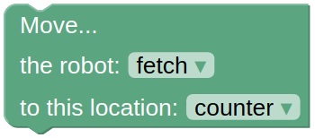

Cafe World
================

This domain features a Fetch Robot, and multiple cans and tables of different colors as shown below.

|

.. note::

  You can learn more about what to do and how to do `here`_.

In all the problems for this domain, the Fetch robot must
pick up multiple cans from a counter and place them on tables as shown in the goal configuration. 
And, Fetch can pick up the cans in front of it one after another, and transport it to the target table one at a time.

The actions that the Fetch robot can take in this environment is:

**Action Group: Move Robot**

1. **Move the robot**:
Use this action to move the Fetch robot to a target location. The robot should n ot be at the target location
for this action to execute successfully.

|

**Action Group: Pick Up**

2. **Pick up a can**:
Use this action to pick up the selected can with the robot's gripper from the selected location. 
A gripper can only hold one can at a time, and only if the path from
robot's gripper to the selected can is not
obstructed by any other can.

|

**Action Group: Place**

3. **Put can on the table**:
Use this action to put the can that the Fetch robot is holding on the selected location.
The selected gripper has to be holding the can before it can place it!

|

.. _here : ../getting_started.html#step-3-learn-to-plan