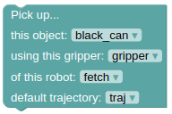

Delicate Cans
================

This domain features a Fetch Robot, and multiple cans of different colors as shown below.

|

.. note::

  You can learn more about what to do and how to do `here`_.

In all the problems for this domain, the Fetch robot must
pick up a can of a specific color as shown in the goal configuration. 
And, Fetch can pick up the cans in front of it one after another such
that the can that Fetch is picking is not obstructed by any other can.

The actions that the Fetch robot can take in this environment is:

**Action Group: Pick up**

1. **Pick up a can**:
Use this action to pick up the selected can with the robot's gripper. 
A gripper can only hold one can at a time, and only if the path from
robot's gripper to the selected can is not
obstructed by any other can. Leave the default trajectory as traj.

|

**Action Group: Place**

2. **Put can on the table**:
Use this action to put the can that the Fetch robot is holding on the table.
The selected gripper has to be holding the can before it can place it!
Leave the default trajectory as traj.

.. image:: ../images/delicateCans/delicateCans_place.png
  :width: 200
  :alt: Put can on the table

|

|

.. _here : ../getting_started.html#step-3-learn-to-plan