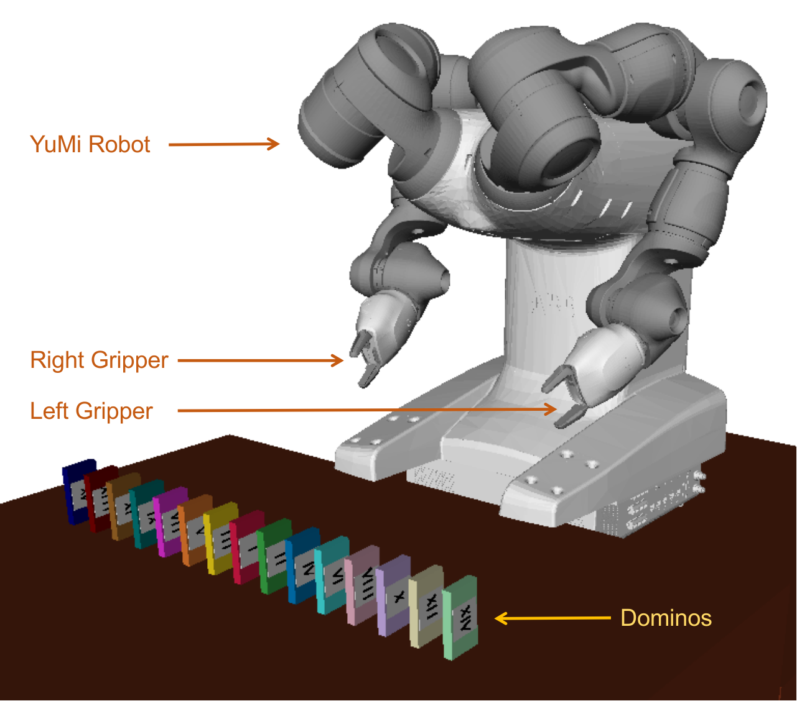
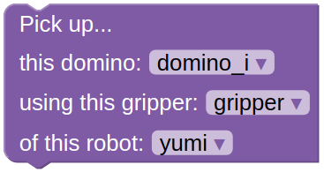

Dominos
================

This domain features an ABB YuMi Robot, and multiple domios as shown below.

|

.. note::

  You can learn more about what to do and how to do `here`_.

In all the problems for this domain, the YuMi robot must
pick up a domino as shown in the goal configuration. 
And, YuMi can pick up the dominos in front of it one after another.

The action that the YuMi robot can take in this environment is:

**Action Group: Pick up**

1. **Pick up a domino**:
Use this action to pick up the selected domino with the selected gripper. 
A gripper can only hold one domino at a time!

|
|

.. _here : ../getting_started.html#step-3-learn-to-plan