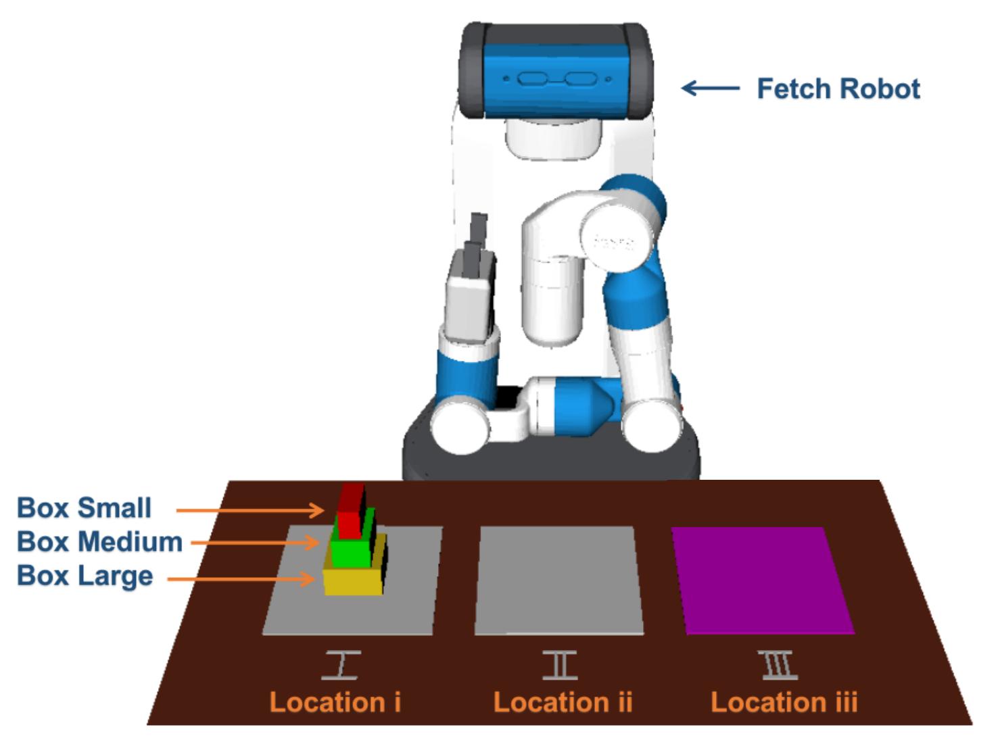
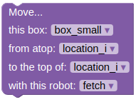

Stack of Towers
================

This domain is inspired from the classic `Tower of Hanoi`_ puzzle.
This version consists of three locations and a number of boxes of various sizes as shown below.

|

.. note::

  You can learn more about what to do and how to do `here`_.

In all the problems for this domain, the Fetch robot must
build structures as shown in the goal configuration using the given boxes , obeying the following rules:

1. Only one box may be moved at a time.
2. Each move consists of taking the upper box from one of the stacks and placing it on top of another stack or on an empty location.
3. No box may be placed on top of a box that is smaller than it.

|

The actions that the Fetch robot can take in this environment are:

|

**Action Group: Move**

|

1. **Move a box**:
Use this action to pick up a box that is sitting on top of another box or at a location and place it on top of another box or in an empty location.

|

.. _Tower of Hanoi : https://en.wikipedia.org/wiki/Tower_of_Hanoi

.. _here : ../getting_started.html#step-3-learn-to-plan
